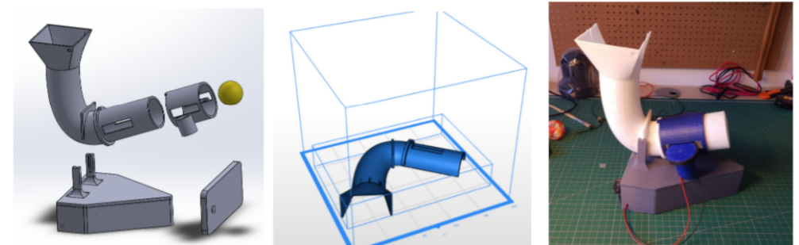
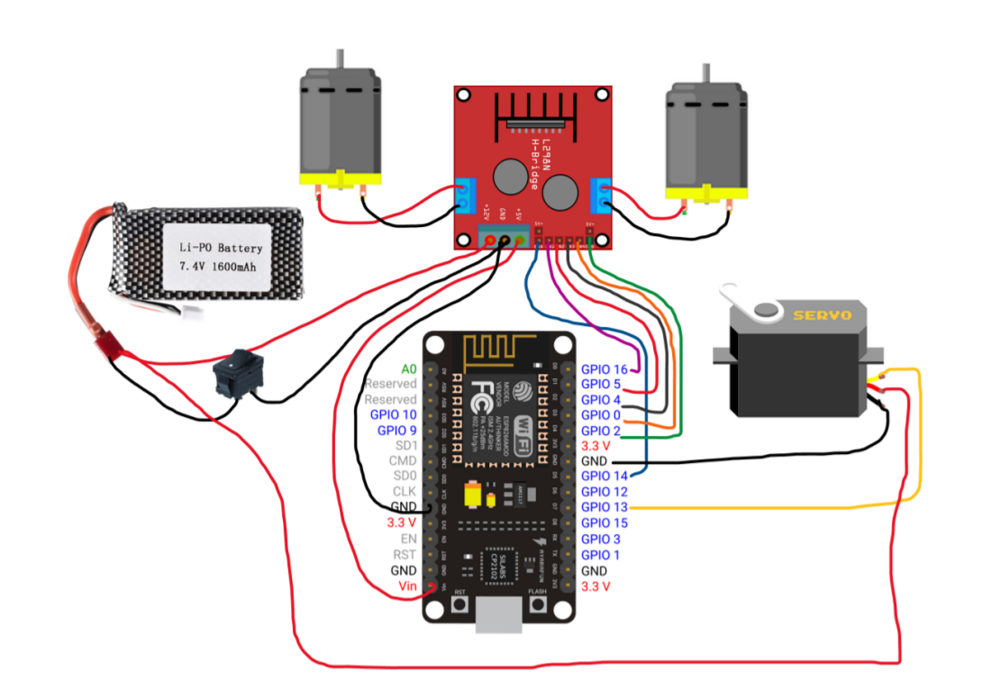

# Ball-Launcher-Reinforcement-Learning
This project consists on designing, assembling and coding a ball tossing robot that learns how to play basketball. The robot uses an IP camera to capture images, and then learns how to throw the ball by means of Reinforcement Learning.

## Design
Solidworks files can be obtained from the folder 'SolidWork parts'

## 3D Print
The .stl documents can be found in the folder 'Print STL files'. I used the printers Zortrax M200 and Zmorph VX.

## Assembly and Electronics
Electronic scheme

## Communicatrion protocols
- Python Server
- Arduino code for ESP8266

## Reinforcement Learning
